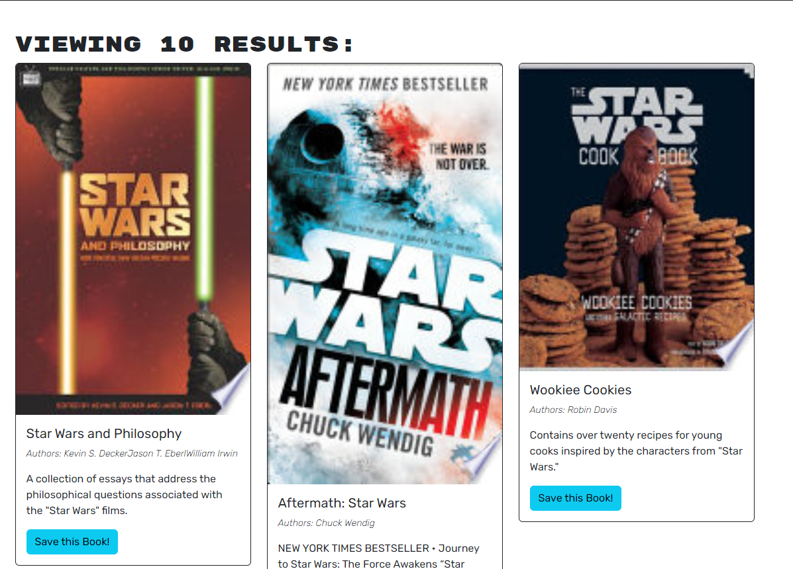
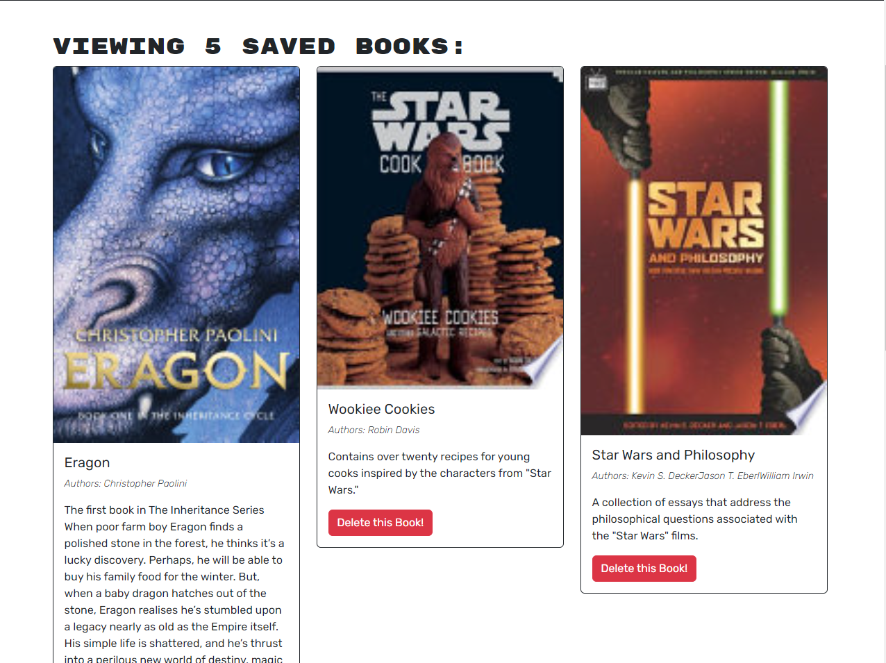

# Book-search-refactor

## Description

This app searches Google's Book API, allowing users to save individual books to their personal profile. I've refactored the code to use GraphQL instead of RESTful routes. Why? Don't ask...

## Installation

To run this code locally, run "npm i" and "npm run develop" in your CLI.

## Usage

This app is deployed at:
https://blooming-forest-87113.herokuapp.com/ a link to my deployed app on heroku

Users can search books without logging in, but to save them, one needs to create an account. User can delete books they saved from their profile page.

https://drive.google.com/file/d/1rYCmDYUeA86UCHiZt9htuvZIfR3SKJPj/view A link to a video showcasing the websites functionality :D

## Media

